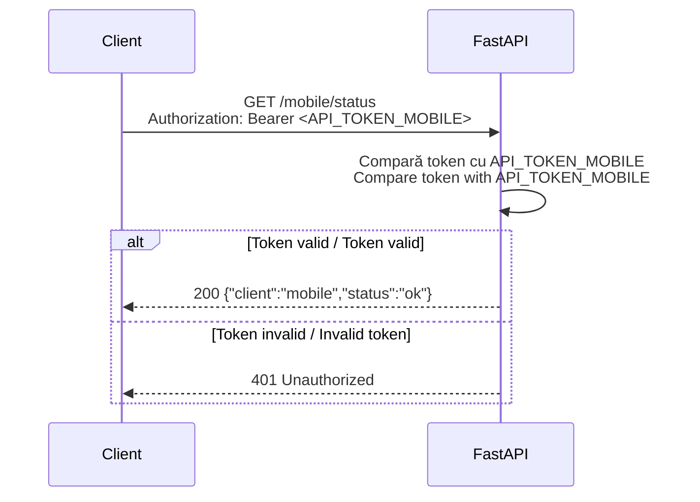
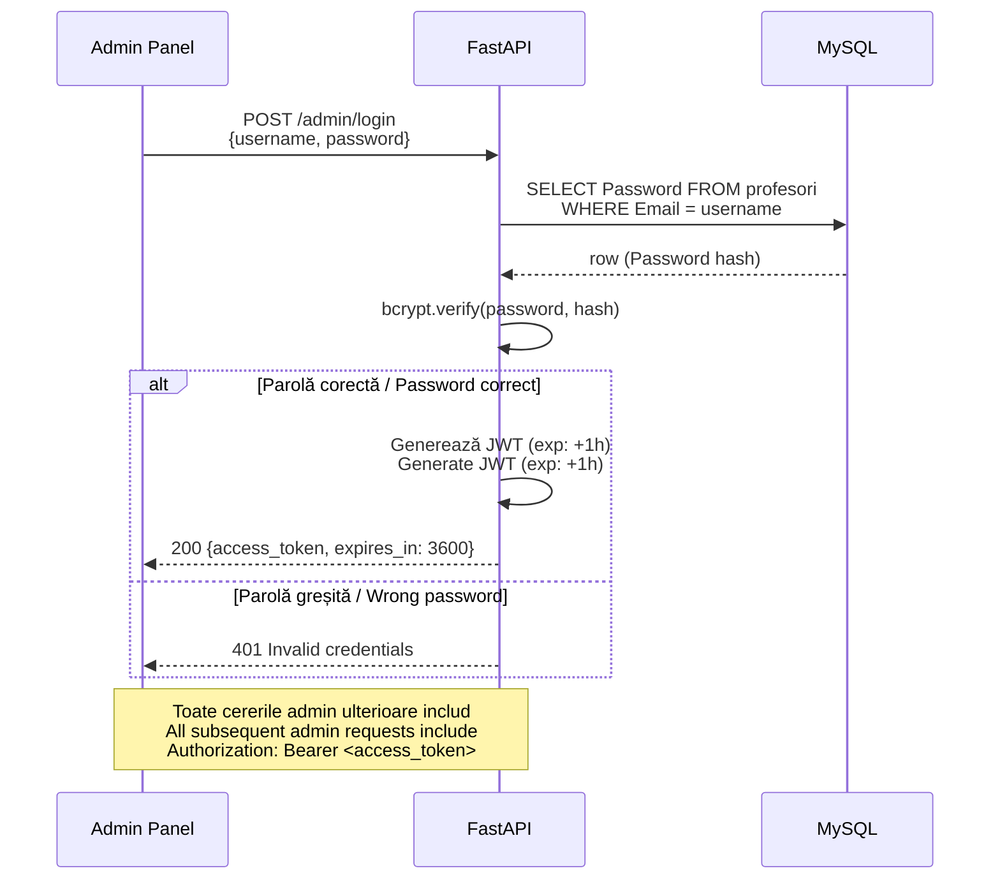
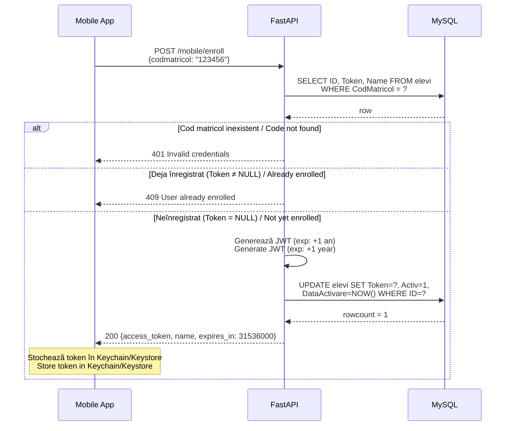

# 🔐 Fluxuri de Autentificare / Authentication Flows

[← Înapoi la index / Back to docs index](README.md)

---

## 🇷🇴 Introducere

Pontaj API folosește trei mecanisme de autentificare distincte, fiecare adaptat unui tip de client:
1. **Token-uri statice Bearer** — pentru verificări de stare per client
2. **JWT admin (1 oră)** — pentru operații administrative (profesori)
3. **JWT elev (1 an)** — emis la înregistrare, folosit pentru sesiunile mobile și generarea QR

## 🇬🇧 Introduction

Pontaj API uses three distinct authentication mechanisms, each tailored to a client type:
1. **Static Bearer tokens** — for per-client status checks
2. **Admin JWT (1 hour)** — for administrative operations (teachers)
3. **Student enroll JWT (1 year)** — issued at enrollment, used for mobile sessions and QR generation

---

## 1. Token-uri Statice Bearer / Static Bearer Tokens

### 🇷🇴 Descriere

Fiecare client (mobile, frontend, admin) are un token static configurat prin variabile de mediu. Aceste token-uri sunt folosite exclusiv pentru endpoint-urile de stare și nu conțin informații despre utilizator.

| Client | Variabilă de mediu | Rute protejate |
|---|---|---|
| Mobile | `API_TOKEN_MOBILE` | `GET /mobile/status` |
| Frontend | `API_TOKEN_FRONTEND` | `GET /frontend/status`, `GET /frontend/items` |
| Admin | `API_TOKEN_ADMIN` | (rezervat pentru extinderi viitoare) |

### 🇬🇧 Description

Each client (mobile, frontend, admin) has a static token configured via environment variables. These tokens are used exclusively for status endpoints and carry no user information.

### Diagrama / Diagram

---

## 2. Flux Autentificare Admin / Admin Login Flow

### 🇷🇴 Descriere

Profesorii se autentifică cu email și parolă. Parola este verificată cu bcrypt față de hash-ul stocat în tabelul `profesori`. La succes, se emite un JWT cu durată de **1 oră**, semnat cu `SECRET_KEY`.

**Endpoint:** `POST /admin/login`  
**Body:** `{"username": "email@exemplu.com", "password": "parola"}`  
**Răspuns:** `{"access_token": "...", "token_type": "bearer", "expires_in": 3600}`

### 🇬🇧 Description

Teachers authenticate with email and password. The password is verified with bcrypt against the hash stored in the `profesori` table. On success, a JWT valid for **1 hour** is issued, signed with `SECRET_KEY`.

### Diagrama / Diagram

---

## 3. Flux Înregistrare Elev / Student Enrollment Flow

### 🇷🇴 Descriere

Elevii se înregistrează o singură dată cu codul lor matricol. La succes, se emite un JWT cu durată de **1 an**, care este stocat și în câmpul `Token` din tabelul `elevi`. Dacă elevul este deja înregistrat (Token ≠ NULL), cererea este respinsă cu 409.

**Endpoint:** `POST /mobile/enroll`  
**Body:** `{"codmatricol": "123456"}`  
**Răspuns:** `{"access_token": "...", "name": "...", "expires_in": 31536000}`

### 🇬🇧 Description

Students enroll once using their matriculation code. On success, a JWT valid for **1 year** is issued and also stored in the `Token` field of the `elevi` table. If the student is already enrolled (Token ≠ NULL), the request is rejected with 409.

### Diagrama / Diagram

---

## ⚠️ Note de Securitate / Security Notes

### 🇷🇴
- **Nu comite niciodată** `SECRET_KEY` sau token-urile API în VCS (Git). Folosește `.env` și asigură-te că este în `.gitignore`.
- **Stochează token-ul de înregistrare** în Keychain (iOS) sau Keystore (Android), nu în SharedPreferences sau localStorage.
- **Rotește token-urile statice** periodic și consideră adăugarea de refresh tokens pentru JWT-urile de lungă durată.
- Durata de 1 an pentru JWT-ul elevului este deliberat lungă pentru UX mobil — consideră scurtarea ei și adăugarea unui mecanism de reînnoire.

### 🇬🇧
- **Never commit** `SECRET_KEY` or API tokens to VCS (Git). Use `.env` and ensure it's in `.gitignore`.
- **Store the enroll token** in Keychain (iOS) or Keystore (Android), not in SharedPreferences or localStorage.
- **Rotate static tokens** periodically and consider adding refresh tokens for long-lived JWTs.
- The 1-year JWT lifetime for students is intentionally long for mobile UX — consider shortening it and adding a renewal mechanism.

---

## 🔗 Vezi și / See Also

- [api-reference.md](api-reference.md) — Detalii complete despre endpoint-uri / Full endpoint details
- [environment.md](environment.md) — Configurarea token-urilor și cheilor / Token and key configuration
