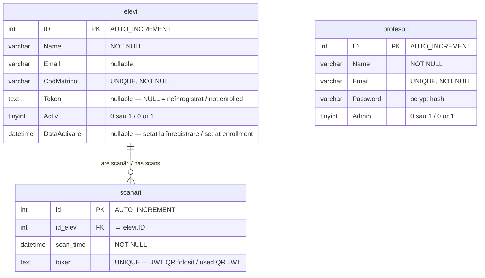

# 🗄️ Schema Bazei de Date / Database Schema

[← Înapoi la index / Back to docs index](README.md)

---

## 🇷🇴 Introducere

Pontaj API folosește o bază de date **MySQL** cu trei tabele principale. Tabelul `elevi` stochează elevii și token-urile lor de sesiune. Tabelul `profesori` stochează conturile administrative. Tabelul `scanari` înregistrează fiecare prezență validată și servește ca registru anti-replay pentru token-urile QR.

## 🇬🇧 Introduction

Pontaj API uses a **MySQL** database with three main tables. The `elevi` table stores students and their session tokens. The `profesori` table stores administrative accounts. The `scanari` table records every validated attendance and serves as the anti-replay registry for QR tokens.

---

## 📐 Diagrama ER / ER Diagram

---

## 📋 Tabele / Tables

### `elevi` — Elevi / Students

| Coloană / Column | Tip / Type | Constrângeri / Constraints | Descriere (RO) | Description (EN) |
|---|---|---|---|---|
| `ID` | `INT` | `PK, AUTO_INCREMENT` | Identificator unic | Unique identifier |
| `Name` | `VARCHAR(255)` | `NOT NULL` | Numele complet al elevului | Student's full name |
| `Email` | `VARCHAR(255)` | `nullable` | Adresa de email | Email address |
| `CodMatricol` | `VARCHAR(8)` | `UNIQUE, NOT NULL` | Codul matricol unic | Unique matriculation code |
| `Token` | `TEXT` | `nullable` | JWT de înregistrare; `NULL` = neînregistrat | Enroll JWT; `NULL` = not yet enrolled |
| `Activ` | `TINYINT` | `DEFAULT 0` | `1` = activ, `0` = inactiv | `1` = active, `0` = inactive |
| `DataActivare` | `DATETIME` | `nullable` | Data și ora înregistrării | Enrollment timestamp |

> **🇷🇴 Notă:** Câmpul `Token` are un dublu rol — este atât token-ul de sesiune al elevului, cât și indicatorul că elevul s-a înregistrat. `NULL` înseamnă că elevul există în sistem (adăugat de admin) dar nu s-a înregistrat încă în aplicație.
>
> **🇬🇧 Note:** The `Token` field serves a dual purpose — it is both the student's session token and the indicator that the student has enrolled. `NULL` means the student exists in the system (added by admin) but hasn't enrolled in the app yet.

---

### `profesori` — Profesori / Teachers

| Coloană / Column | Tip / Type | Constrângeri / Constraints | Descriere (RO) | Description (EN) |
|---|---|---|---|---|
| `ID` | `INT` | `PK, AUTO_INCREMENT` | Identificator unic | Unique identifier |
| `Name` | `VARCHAR(255)` | `NOT NULL` | Numele complet | Full name |
| `Email` | `VARCHAR(255)` | `UNIQUE, NOT NULL` | Email folosit la autentificare | Email used for login |
| `Password` | `VARCHAR(255)` | `NOT NULL` | Hash bcrypt al parolei | bcrypt hash of the password |
| `Admin` | `TINYINT` | `DEFAULT 0` | `1` = administrator, `0` = profesor standard | `1` = administrator, `0` = standard teacher |

---

### `scanari` — Scanări / Scans

| Coloană / Column | Tip / Type | Constrângeri / Constraints | Descriere (RO) | Description (EN) |
|---|---|---|---|---|
| `id` | `INT` | `PK, AUTO_INCREMENT` | Identificator unic | Unique identifier |
| `id_elev` | `INT` | `FK → elevi.ID` | Referință la elev | Reference to student |
| `scan_time` | `DATETIME` | `NOT NULL` | Momentul scanării | Scan timestamp |
| `token` | `TEXT` | `UNIQUE` | JWT QR folosit (anti-replay) | Used QR JWT (anti-replay) |

> **🇷🇴 Notă:** Constrângerea `UNIQUE` pe coloana `token` este mecanismul principal anti-replay. Chiar dacă un JWT QR nu a expirat, nu poate fi folosit de două ori.
>
> **🇬🇧 Note:** The `UNIQUE` constraint on the `token` column is the primary anti-replay mechanism. Even if a QR JWT hasn't expired, it cannot be used twice.

---

## 🔗 Vezi și / See Also

- [qr-flow.md](qr-flow.md) — Cum este folosit tabelul `scanari` în fluxul de prezență
- [auth-flow.md](auth-flow.md) — Cum este stocat și folosit câmpul `Token` din `elevi`
