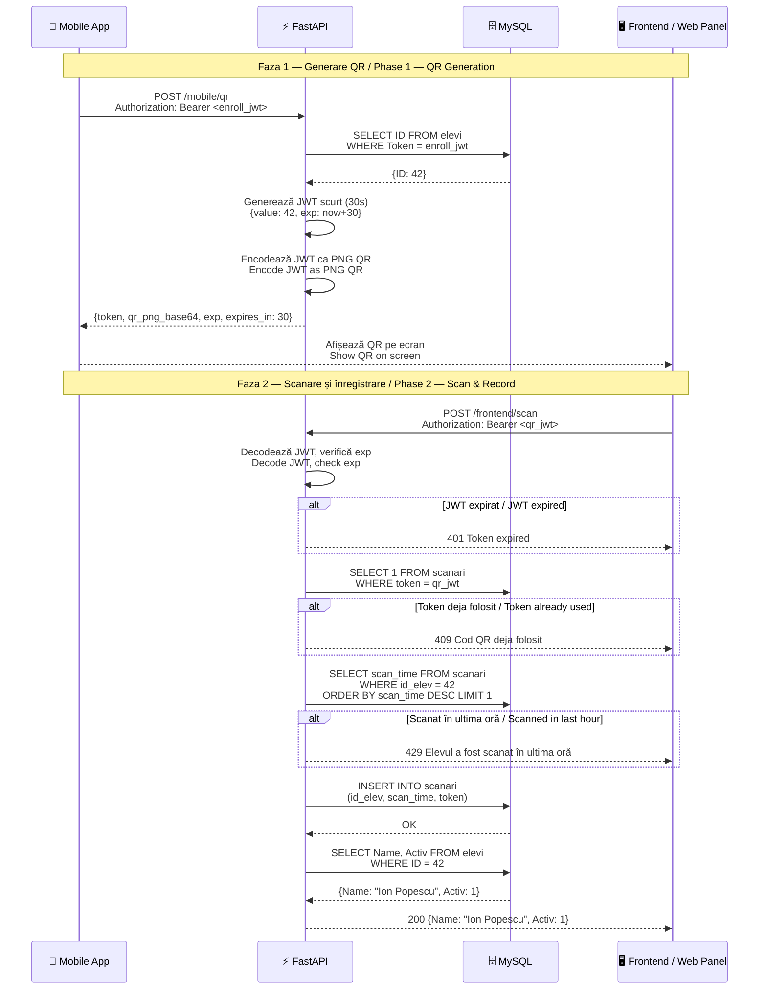

# 📱 Fluxul de Prezență QR / QR Presence Flow

[← Înapoi la index / Back to docs index](README.md)

---

## 🇷🇴 Prezentare generală

Fluxul de prezență QR este mecanismul central al sistemului Pontaj. La fiecare oră de curs, elevul generează un cod QR din aplicația mobilă. Profesorul sau panoul web scanează codul, iar prezența este înregistrată automat. Codul QR conține un JWT cu durată de **30 de secunde** — după expirare sau după prima utilizare, codul devine invalid.

## 🇬🇧 Overview

The QR presence flow is the core mechanism of the Pontaj system. At each class, the student generates a QR code from the mobile app. The teacher or web frontend scans the code, and attendance is automatically recorded. The QR code contains a JWT valid for **30 seconds** — after expiry or first use, the code becomes invalid.

---

## 🔄 Fluxul complet / Full Flow

### 🇷🇴 Pași
1. Elevul deschide aplicația mobilă și apasă „Generează QR"
2. Aplicația trimite `POST /mobile/qr` cu JWT-ul de înregistrare
3. API-ul caută ID-ul elevului în baza de date după token
4. API-ul generează un JWT de scurtă durată (`{value: ID, exp: now+30}`)
5. JWT-ul este encodat ca imagine PNG QR și returnat aplicației
6. Elevul arată codul QR profesorului / panoului web
7. Panoul web trimite `POST /frontend/scan` cu JWT-ul din QR
8. API-ul decodează JWT-ul și verifică expirarea
9. API-ul verifică că token-ul nu a mai fost folosit (anti-replay)
10. API-ul verifică că elevul nu a fost scanat în ultima oră (cooldown)
11. API-ul inserează înregistrarea în tabelul `scanari`
12. Panoul web primește confirmarea cu numele și statusul elevului

### 🇬🇧 Steps
1. Student opens the mobile app and taps "Generate QR"
2. App sends `POST /mobile/qr` with the enroll JWT
3. API looks up the student's ID in the database by token
4. API generates a short-lived JWT (`{value: ID, exp: now+30}`)
5. JWT is encoded as a PNG QR image and returned to the app
6. Student shows the QR code to the teacher / web panel
7. Web panel sends `POST /frontend/scan` with the JWT from the QR
8. API decodes the JWT and checks expiry
9. API verifies the token hasn't been used before (anti-replay)
10. API verifies the student wasn't scanned in the last hour (cooldown)
11. API inserts the record into the `scanari` table
12. Web panel receives confirmation with the student's name and status

---

## 📐 Diagrama secvențială / Sequence Diagram

---

## 🛡️ Protecție anti-replay și cooldown / Anti-Replay & Cooldown Protection

### 🇷🇴

Sistemul implementează două niveluri de protecție împotriva abuzurilor:

**1. Anti-replay (token unic)**  
Fiecare JWT QR este stocat în tabelul `scanari` la prima utilizare. Orice tentativă de reutilizare a aceluiași token returnează `409 Conflict`. Aceasta previne ca un elev să partajeze codul QR cu altcineva.

**2. Cooldown de 1 oră**  
Chiar dacă un elev generează un nou QR, nu poate fi înregistrat de mai mult de o dată pe oră. Dacă ultima scanare a fost în urmă cu mai puțin de 3600 de secunde, cererea returnează `429 Too Many Requests`.

### 🇬🇧

The system implements two levels of abuse protection:

**1. Anti-replay (unique token)**  
Each QR JWT is stored in the `scanari` table on first use. Any attempt to reuse the same token returns `409 Conflict`. This prevents a student from sharing their QR code with someone else.

**2. 1-hour cooldown**  
Even if a student generates a new QR, they cannot be recorded more than once per hour. If the last scan was less than 3600 seconds ago, the request returns `429 Too Many Requests`.

---

## 🔗 Vezi și / See Also

- [auth-flow.md](auth-flow.md) — Cum funcționează JWT-urile / How JWTs work
- [api-reference.md](api-reference.md) — Detalii endpoint `/mobile/qr` și `/frontend/scan`
- [database.md](database.md) — Schema tabelului `scanari`
